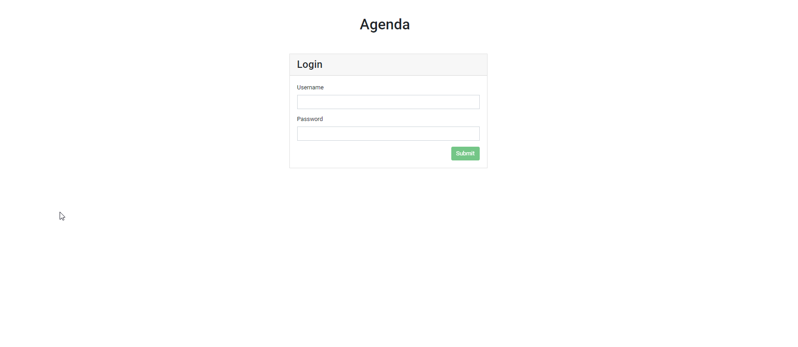
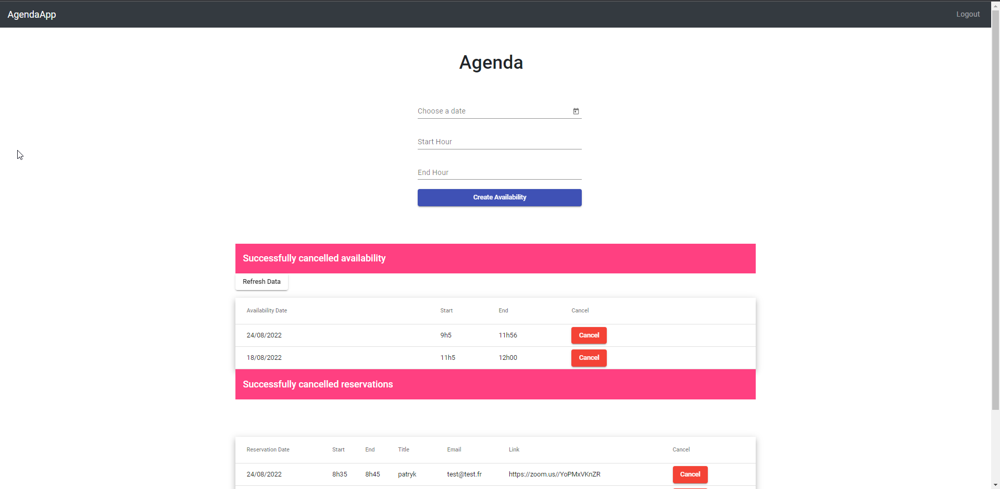

# Agenda-WebApp-Angular-Express

In this project I have built a simple agenda WebApp using Angular and Express  

The application is implemented as follow:

### Database that stores availabilities and reservations

- `availabilities` table contain `start` and `end` columns that define the duration of a time slot.
- `reservations` table contain the following columns:
    - `start` - start time of the reserved event
    - `end` - end time of the event
    - `title` - title of the event
    - `email` - email of a person making the reservation

> For the sake of simplicity we choose to use a MongoDB dockerized DB

### Backend

The backend of an application has an API to:

- **create** and **delete** availabilities
- **create** reservations (Note that reservations can be shorter than available time slots)
- **delete** reservations (email should be provided with the request to validate if it matches the one specified at event creation)
- **list** currently available slots

### Frontend

From the frontend we are able to:

- see slots available for reservations
- provide a `start`, `end`, `title` and `email` for a new reservation and save it

   
There is also a login/logout system in place   
 
An admin can cancel/add both availabilities and reservations   

An anonymous user can only book available slots   

# Run the React front end (Angular)
cd app   
npm install    
Update .env variables (for example: API_URL: 'http://localhost:3000')   
ng serve   

# Run the API server (Express)
cd api   
npm install   
npm i mongodb cors   
nodemon npm start   
   

